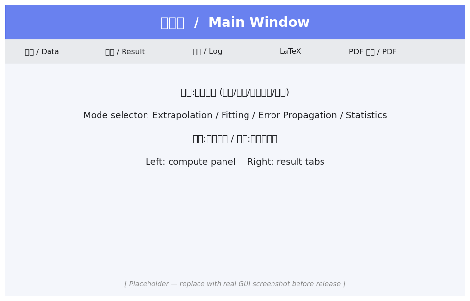
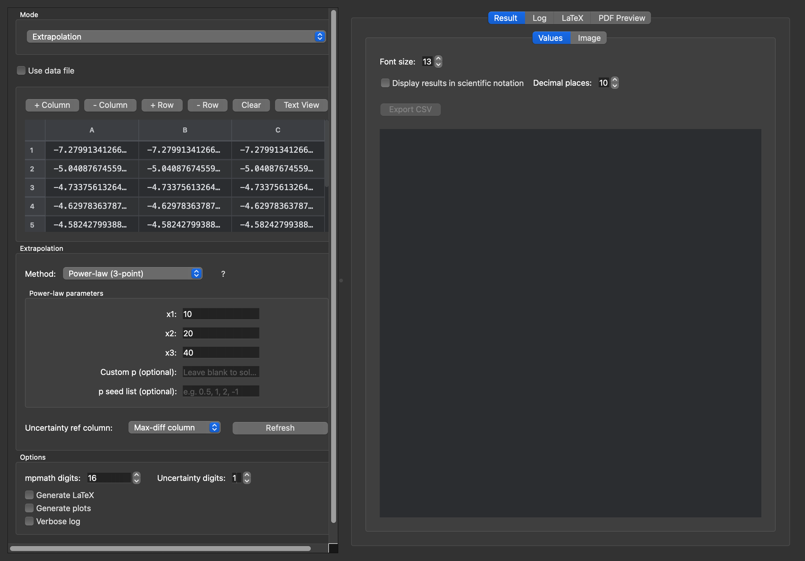
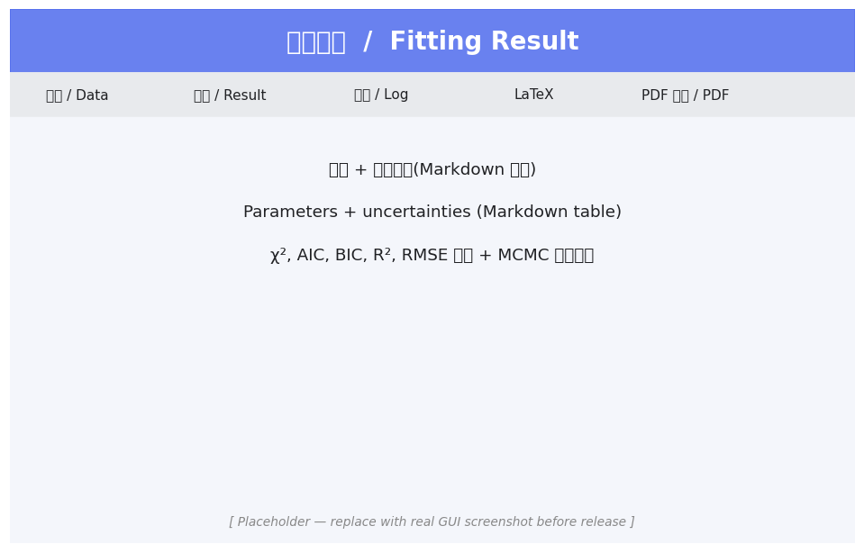
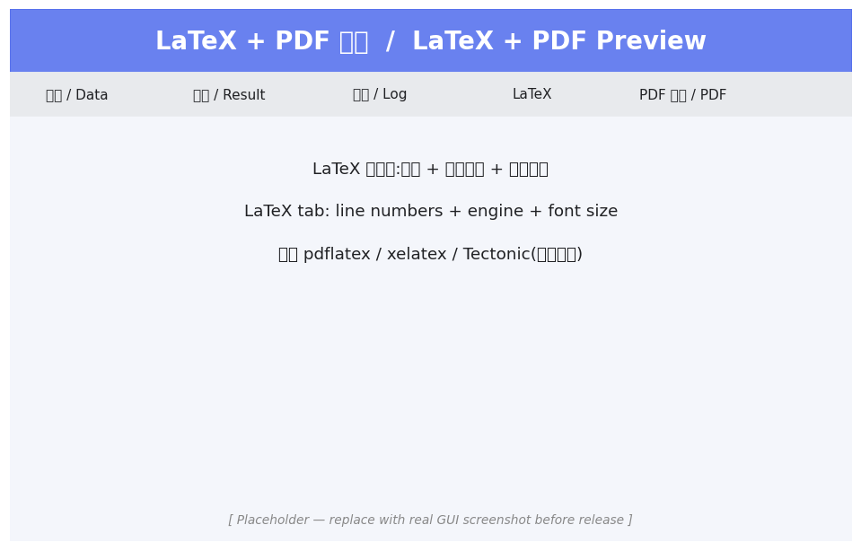

# DataLab — High-Precision Extrapolation, Fitting & Error Propagation

> **中文 · English** — 一套基于 mpmath 高精度计算的科研工具,支持桌面 GUI 和 Web 双前端。
> A research-grade scientific toolkit with high-precision (mpmath) sequence
> extrapolation, curve fitting, error propagation, and weighted statistics —
> shipped as both a PySide6 desktop app and a Flask web app sharing one core.

---

## 🇨🇳 中文文档

### ✨ 主要功能

| 模式 | 用途 | 算法 |
|------|------|------|
| **序列外推** | 把数值方法在不同步长下的近似值外推到极限 | Richardson、Wynn-ε(Shanks)、Levin u-transform、自定义公式 |
| **曲线拟合** | 带不确定度的非线性最小二乘拟合 + 自动模型选择(AIC/BIC) | 多项式、Padé、自定义表达式;可选 MCMC 后验优化 |
| **误差传递** | 对 `1.23(4)[-2]` 形式数据按公式自动传播 1σ 不确定度 | SymPy 偏导数 + Monte Carlo |
| **统计平均** | 加权 / 算术平均 + 标准误差 + RMS 散度 | 单边 / 双边、加权方差 |

### 🚀 一键安装(开箱即用)

| 平台 | 下载 | 大小 |
|------|------|------|
| 🍎 **macOS (Apple Silicon)** | `DataLab-macos.zip` | ~64 MB |
| 🪟 **Windows 10/11 (x64)** | `DataLab-windows.zip` | ~83 MB |

**包内已嵌入** Python 解释器 + PySide6 + 全部科学计算依赖,**无需额外安装任何环境**。

#### macOS 使用方法

1. 解压 `DataLab-macos.zip` → `DataLab.app`
2. 双击运行(首次启动右键 → "打开" 绕过 Gatekeeper 警告)
3. 可选:把 `DataLab.app` 拖到 `/Applications/` 注册到启动台

#### Windows 使用方法

1. 解压 `DataLab-windows.zip` → `DataLab\` 目录
2. 双击 `DataLab\DataLab.exe`
3. 不要单独移动 .exe — Python 运行时在同目录的 `_internal\` 下

### 📷 界面截图

> 截图位于 [`docs/screenshots/`](docs/screenshots/),来自 macOS 上运行的桌面 GUI(Qt 内部 grab 直出,1400×900)。


*主界面:左侧计算面板,右侧 5 个标签页(数据 / 结果 / 日志 / LaTeX / PDF 预览)*


*数据表:列宽均分、加减行列按钮、文本视图切换、CSV 粘贴*


*拟合结果:参数 + 不确定度 Markdown 表 + χ²/AIC/BIC + 可选 MCMC 后验*


*LaTeX 标签页:行号 + 引擎下拉框 + 字体大小;支持 pdflatex / xelatex / Tectonic*

### 🏃 快速上手(用内置示例)

`examples/` 目录已附 5 个示例文件,直接加载即可学习每种模式的数据格式:

```
examples/
├── extrapolation_richardson.txt    # 外推:3 列序列 → Richardson 三点加速
├── fitting_powerlaw.txt            # 拟合:y = 2.5x^-0.7 + 0.1 + 高斯噪声
├── error_propagation.txt           # 误差传递:V1, V2 + 各自 σ
├── statistics_weighted.txt         # 统计:10 次加权测量
└── constants.txt                   # 物理常数:ALPHA, G, c, h, hbar, kB, NA, e
```

**步骤:**
1. 启动 GUI → 顶部 mode 下拉框选模式(如 "Extrapolation")
2. "打开数据文件" → 选 `examples/<对应文件>.txt`
3. 误差传递模式:在"常数文件"字段加载 `examples/constants.txt`,公式输入 `(V1+V2)/V1`
4. 点 "开始执行" → 看 "结果" 标签
5. 切到 "LaTeX" 标签 → 选引擎(默认 Tectonic,首次会自动下载 ~30 MB)→ 点编译 → "PDF 预览" 标签看渲染结果

### 🔢 不确定度括号语法

DataLab 在数据文件 / 公式输入 / 常数文件里都支持紧凑的括号不确定度:

| 写法 | 数值 | σ |
|------|------|---|
| `1.234(5)` | 1.234 | 0.005(末位 5 个单位) |
| `1.234(5)[-3]` | 1.234e-3 | 0.005e-3 |
| `7.2973525693(11)[-3]` | 7.2973525693e-3 | 1.1e-12 |
| `299792458` | 299792458 | 0(精确值) |

### 📦 LaTeX 引擎

- **Tectonic(默认推荐)** — 单文件二进制,GUI 首次使用会自动下载到 `~/.datalab/bin/`,自动联网解析缺失的 LaTeX 包。无需 TeX Live。
- **pdflatex / xelatex** — 如果你已装了 TeX Live / MiKTeX,从下拉框选这两个即可。

### 🔬 高精度计算

- 默认精度:50–80 dps(可在精度 spinbox 调整,上限 100 万 dps)
- 所有计算包在 `precision_guard()` 上下文里,跨 worker 线程隔离 `mp.dps`
- 自动单元测试覆盖 Mathematica 高精度参考值(`tests/test_*_mathematica_reference.py`)

### 🛠️ 从源码运行(开发者)

```bash
# 桌面 GUI
pip install -r gui_requirements.txt
python data_extrapolation_gui.py

# Web 应用
pip install -r web_requirements.txt
python app_web/server.py    # 默认 http://127.0.0.1:8000

# 测试
pip install -r requirements-test.txt
QT_QPA_PLATFORM=offscreen pytest -q   # 770+ tests
```

详细架构 + 跨平台打包指南见 [`docs/ARCHITECTURE.md`](docs/ARCHITECTURE.md) 和 [`docs/desktop/`](docs/desktop/) / [`docs/web/`](docs/web/)。

---

## 🇬🇧 English

### ✨ Features

| Mode | Purpose | Methods |
|------|---------|---------|
| **Extrapolation** | Take a numerical method's approximations at decreasing step sizes and extrapolate to the limit | Richardson, Wynn-ε (Shanks), Levin u-transform, custom formulas |
| **Curve Fitting** | Non-linear least-squares with measurement uncertainties + automatic model selection (AIC/BIC) | Polynomial, Padé, arbitrary expression; optional MCMC posterior refinement |
| **Error Propagation** | Propagate 1σ uncertainties from `1.23(4)[-2]`-style data through user formulas | SymPy partial derivatives + Monte Carlo cross-check |
| **Statistics** | Weighted / arithmetic mean + standard error + RMS scatter | One-sided / two-sided, weighted variance |

### 🚀 One-click install (zero dependencies)

| Platform | Download | Size |
|----------|----------|------|
| 🍎 **macOS (Apple Silicon)** | `DataLab-macos.zip` | ~64 MB |
| 🪟 **Windows 10/11 (x64)** | `DataLab-windows.zip` | ~83 MB |

The bundle ships Python + PySide6 + the full scientific stack — **no extra
runtime install needed**.

#### macOS

1. Unzip `DataLab-macos.zip` → `DataLab.app`
2. Double-click. First launch: Right-click → "Open" to bypass the Gatekeeper notice.
3. Optional: drag `DataLab.app` into `/Applications/` to register it.

#### Windows

1. Unzip `DataLab-windows.zip` → `DataLab\` folder
2. Double-click `DataLab\DataLab.exe`
3. Don't move `.exe` out of the folder — the Python runtime lives in the
   sibling `_internal\` directory.

### 📷 Screenshots

See [`docs/screenshots/`](docs/screenshots/) — captured directly from the
desktop GUI on macOS via Qt's in-process `QWidget.grab()` (1400×900 window).

### 🏃 Quick start (with bundled examples)

The `examples/` directory ships five working input files so a new user can
load real data into each mode without inventing test data:

```
examples/
├── extrapolation_richardson.txt   # 3-col Richardson three-point sequence
├── fitting_powerlaw.txt           # y = 2.5 x^-0.7 + 0.1 + Gaussian noise
├── error_propagation.txt          # V1, V2 each with measurement σ
├── statistics_weighted.txt        # 10 independent weighted measurements
└── constants.txt                  # ALPHA, G, c, h, hbar, kB, NA, e (with σ)
```

Workflow: start the GUI → pick a mode → load the matching example file →
"Run" → switch to the "LaTeX" tab → pick an engine (Tectonic is the default
and auto-downloads on first use) → compile → see PDF in the preview tab.

### 🔢 Uncertainty notation

DataLab accepts the compact parenthetical notation used by the high-precision
data community:

| Token | Value | σ |
|-------|-------|---|
| `1.234(5)` | 1.234 | 0.005 (last-digit units) |
| `1.234(5)[-3]` | 1.234e-3 | 0.005e-3 |
| `299792458` | 299792458 | 0 (exact) |

### 📦 LaTeX engines

- **Tectonic (default, recommended)** — single ~30 MB binary, auto-downloads
  to `~/.datalab/bin/` on first use, fetches missing LaTeX packages over the
  net per-document. No TeX Live required.
- **pdflatex / xelatex** — pick from the dropdown if you already have TeX Live
  or MiKTeX installed.

### 🛠️ Running from source

```bash
pip install -r gui_requirements.txt
python data_extrapolation_gui.py

# or web app:
pip install -r web_requirements.txt
python app_web/server.py

# tests:
pip install -r requirements-test.txt
QT_QPA_PLATFORM=offscreen pytest -q   # 770+ tests
```

For architecture + per-platform packaging see [`docs/ARCHITECTURE.md`](docs/ARCHITECTURE.md) and
[`docs/desktop/`](docs/desktop/) / [`docs/web/`](docs/web/).

---

## 🤝 Reporting issues / Contributing

Issues and pull requests welcome at
[GitHub Issues](https://github.com/yilibinbin/DataLab/issues).
When reporting a numerical bug please include the **exact input data** (or
attach the offending file) and the active precision setting — high-precision
regressions are usually trivial to reproduce given the inputs.

For development setup, coding conventions, and the PR flow see
[`CONTRIBUTING.md`](CONTRIBUTING.md). Security vulnerabilities go through the
private channel described in [`SECURITY.md`](SECURITY.md), **not** public
issues. Per-version changes are tracked in [`CHANGELOG.md`](CHANGELOG.md).

## 📜 License

DataLab is released under the [MIT License](LICENSE). The bundled LaTeX
engine ([Tectonic](https://tectonic-typesetting.github.io/)) is downloaded
on-demand and licensed separately under the MIT License.
