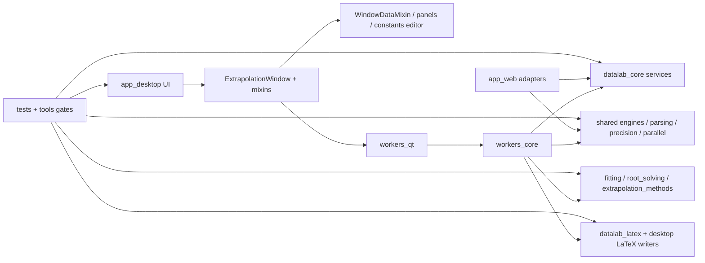
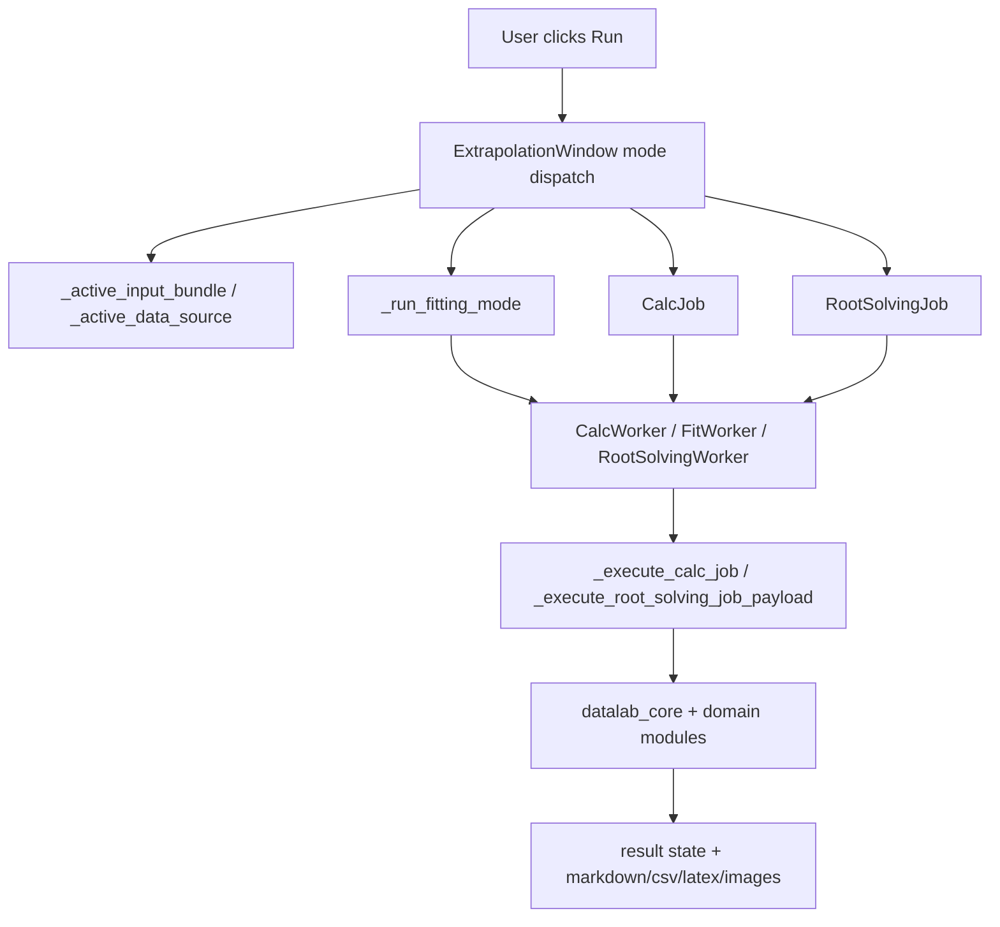
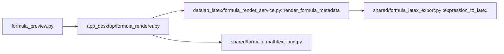
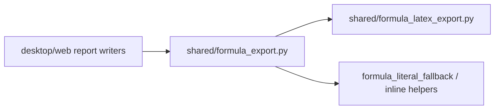

# DataLab Code View Map: codegraph + graphify

Date: 2026-06-18

Purpose: provide a durable navigation map for DataLab debugging and implementation work. This file records how the code graph was built, what each graph is good for, and the main module/call paths to inspect before changing code.

## Generated Artifacts

- codegraph index: `.codegraph/` in this worktree.
  - Indexed files: 497.
  - Nodes: 10,342.
  - Edges: 28,271.
  - Languages: 484 Python, 8 JavaScript, 5 YAML.
- graphify AST graph: `build/graphify-codeview/graphify-out/graph.json`.
  - Source corpus: `/tmp/datalab-graphify-code-corpus`.
  - Nodes: 8,333.
  - Edges: 24,113.
  - HTML tree: `build/graphify-codeview/graphify-out/GRAPH_TREE.html`.

## Tool Notes

- codegraph is best for exact symbol lookup, callers, callees, and source-local impact tracing.
- graphify is best for broad architectural traversal, visual browsing, and quick path/explain queries.
- graphify full-repo extraction requires an LLM key because the repository contains docs, papers, and images. For offline code-only mapping, copy only Python/JavaScript source into `/tmp/datalab-graphify-code-corpus`, then run graphify on that directory.
- graphify shortest paths can be noisy when common imports such as `dataclasses` bridge unrelated nodes. Use graphify for broad hints, then verify exact flows with codegraph.

## High-Level Architecture



## Primary Desktop Shell

- `app_desktop/window.py`
  - `ExtrapolationWindow` is the desktop composition root.
  - It inherits `WindowLatexPdfMixin`, `WindowI18nMixin`, `WindowImagesMixin`, `WindowStatisticsMixin`, `WindowDataMixin`, `WindowFittingMixin`, and `WindowExtrapolationMixin`.
- `app_desktop/panels.py`
  - Main left/right/center panel construction.
  - `build_left_panel()` is the left rail entry point.
  - Data table serialization and adaptive table helpers are wired here.
- `app_desktop/views/`
  - Mode-specific left-rail builders:
    - `extrapolation.py`
    - `error.py`
    - `statistics.py`
    - `fitting.py`
    - `root_solving.py`
  - `helpers.py` owns shared view helpers such as table sizing and section-card utilities.
- `app_desktop/workbench_formula_panel.py`
  - Shared formula editor/preview area.
- `app_desktop/workbench_variable_panel.py`
  - Parameter/unknown/constant panel placement.
- `app_desktop/workbench_results.py`
  - Result overview/details presentation.
- `app_desktop/workspace_controller.py`
  - Workspace capture/restore bridge between UI widgets and workspace schema.

## Input and Constants Flow

Key symbols:

- `app_desktop/window_data_mixin.py::_active_input_bundle`
- `app_desktop/window_data_mixin.py::_active_constants_source`
- `shared/input_normalization.py::parse_input_sections`
- `shared/input_normalization.py::normalize_constants_state`
- `app_desktop/fitting_input_normalization.py::normalize_fitting_input`

Observed codegraph callers of `_active_input_bundle`:

- `app_desktop/window.py::_build_root_solving_job`
- `app_desktop/window_data_mixin.py::_active_constants_source`
- `app_desktop/window_data_mixin.py::_active_data_source`
- `app_desktop/window_extrapolation_mixin.py::run_calculation`

Interpretation:

- The unified input boundary is `WindowDataMixin`.
- Mode code should consume `_active_input_bundle()` or one of its adapters, not parse table/text/file/constants independently.
- Fitting parameter detection should exclude constants through `_active_constants_source()`.
- Root solving unknown detection should also use `_active_constants_source()`.

## Calculation Dispatch Flow



## General Calculation Worker

Key symbol:

- `app_desktop/workers_core.py::_execute_calc_job`

Codegraph callees include:

- `shared/extrapolation_engine.py::parse_extrapolation_string`
- `datalab_core/service_factory.py::create_core_session_service`
- `datalab_latex/latex_tables_extrapolation.py::process_data_string`
- `datalab_latex/latex_tables_extrapolation.py::generate_latex_table`
- `datalab_latex/latex_tables_error_propagation.py::process_constants_string`
- `shared/error_propagation_engine.py::apply_formula_to_data`
- `statistics_utils.py::generate_statistics_latex_batches`

Interpretation:

- Extrapolation, error propagation, and statistics still converge through `CalcJob` / `_execute_calc_job`.
- Core DTO snapshots and legacy writer paths coexist here. When changing a result format or LaTeX output, inspect both the `datalab_core` payload conversion and the legacy writer branch.

## Root Solving Flow

Key symbols:

- `app_desktop/window.py::_build_root_solving_job`
- `app_desktop/workers_qt.py::RootSolvingWorker`
- `app_desktop/workers_core.py::_execute_root_solving_job_payload`
- `root_solving/batch.py::solve_root_batch`
- `root_solving/formatting.py::render_root_batch_result`
- `root_solving/plotting.py::render_nominal_root_plots`
- `app_desktop/root_latex_writer.py`

Graphify useful path:

```text
ExtrapolationWindow --uses--> RootSolvingJob
RootSolvingJob <--references-- _execute_root_solving_job_payload()
_execute_root_solving_job_payload() --calls--> solve_root_batch()
```

codegraph callees of `_execute_root_solving_job_payload` include:

- `normalize_constants_state`
- `create_core_session_service`
- `root_batch_payload_to_result`
- `precision_guard`
- `parse_uncertainty_format`
- `solve_root_batch`
- `normalize_root_problem_from_context`
- `render_nominal_root_plots`
- `render_root_batch_result`

Interpretation:

- Root-solving UI bugs usually start at `views/root_solving.py` or `_build_root_solving_job`.
- Computation/uncertainty issues usually start at `root_solving/batch.py`, `solver.py`, `uncertainty.py`, or `uncertainty_policy.py`.
- Display/LaTeX/image issues usually start at `root_solving/formatting.py`, `plotting.py`, or `app_desktop/root_latex_writer.py`.

## Fitting Flow

Key symbols:

- `app_desktop/window_fitting_mixin.py::WindowFittingMixin`
- `app_desktop/window_fitting_models_mixin.py::_run_fitting_mode`
- `app_desktop/window_fitting_models_mixin.py::_prepare_fit_job`
- `app_desktop/workers_qt.py::FitWorker`
- `app_desktop/workers_qt.py::FitBatchWorker`
- `fitting/runner.py::FitRunner`
- `fitting/implicit_model.py`
- `fitting/output_inversion.py`
- `fitting/hp_fitter.py`
- `app_desktop/fitting_latex_writer.py`

codegraph callees of `_run_fitting_mode` include:

- `_collect_batched_fitting_dataset`
- `_peek_user_precision`
- `_build_batches_from_segments`
- `_prepare_fit_job`
- `_execute_fit_async`
- `_start_worker_with_workbench_result_state`

Interpretation:

- GUI model/config issues: `views/fitting.py`, `window_fitting_models_mixin.py`, `parameter_table.py`, `workbench_variable_panel.py`.
- Input normalization issues: `app_desktop/fitting_input_normalization.py`.
- Algorithm/performance issues: `fitting/runner.py`, `hp_fitter.py`, `implicit_model.py`, `output_inversion.py`.
- Fitting result/plot/LaTeX issues: `window_fitting_residuals_mixin.py`, `window_fitting_formatters_mixin.py`, `plot_fitting.py`, `fitting_latex_writer.py`.

## Formula Preview and Formula LaTeX Export

Formula preview path:



Report/table formula export path:



Important distinction:

- `render_formula_metadata()` is the preview metadata boundary.
- `expression_to_latex()` is the AST-backed formula-to-LaTeX renderer.
- `shared/formula_export.py` is the safer report/export wrapper because it owns DTOs and literal fallback behavior.
- Do not route report formulas through desktop preview widgets.

## LaTeX Generation and Compilation

Entry points:

- `app_desktop/window_latex_pdf_mixin.py`
- `shared/latex_engine.py`
- `datalab_latex/latex_tables_common.py`
- `datalab_latex/latex_tables_error_propagation.py`
- `datalab_latex/latex_tables_extrapolation.py`
- `app_desktop/fitting_latex_writer.py`
- `app_desktop/root_latex_writer.py`
- `statistics_utils.py::generate_statistics_latex_batches`
- `tools/latex_option_matrix.py`

Debugging rule:

- If generated `.tex` is bad, start at the mode-specific writer.
- If `.tex` is good but compilation fails, start at `window_latex_pdf_mixin.py` and `shared/latex_engine.py`.
- If an option matrix case fails, inspect `build/latex-option-matrix/manifest.json` and the generated `.tex`.

## Parallelism and Precision

Entry points:

- `shared/parallel_backend.py`
- `shared/parallel_config.py`
- `app_desktop/parallel_preferences.py`
- `datalab_core/parallel_options.py`
- `shared/precision.py::precision_guard`
- worker entry points in `app_desktop/workers_core.py`

Rule:

- GUI settings should be converted into core `JobOptions` / parallel option DTOs before entering workers.
- Use `precision_guard` in backend compute/plot paths that touch `mpmath`.
- Avoid adding module-local worker pools; route through shared parallel helpers.

## Workspace and Examples

Entry points:

- `app_desktop/workspace_controller.py`
- `shared/workspace_io.py`
- `shared/workspace_schema.py`
- `datalab_core/workbench_model.py`
- `datalab_core/workspace_v2.py`
- `examples/catalog.py`
- `tools/generate_example_workspaces.py`

Rule:

- Desktop widget capture/restore belongs in `workspace_controller.py`.
- Versioned schema compatibility belongs in `shared/workspace_*` and `datalab_core/workbench_model.py`.
- Example workspace generation should be verified with `tools/generate_example_workspaces.py --check` and GUI example tests.

## Web App Boundary

Entry points:

- `app_web/blueprints/api.py`
- `app_web/blueprints/sse.py`
- `app_web/logic/common.py`
- `app_web/logic/extrapolation.py`
- `app_web/logic/error_propagation.py`
- `app_web/logic/fitting.py`
- `app_web/logic/statistics.py`
- `app_web/logic/plots.py`

Rule:

- Web adapters should consume `datalab_core` and `shared` services, not desktop widgets.
- Formula preview API should use `datalab_latex.formula_render_service` metadata, matching desktop preview without importing desktop renderers.

## Test Navigation

High-value focused tests by area:

- Desktop shell/schema/screens:
  - `tests/test_desktop_gui_schema_scan.py`
  - `tests/test_desktop_workbench_visual_screenshots.py`
  - `tools/scan_desktop_gui_schema.py`
  - `tools/capture_desktop_gui_screens.py`
- Input/constants/workspace:
  - `tests/test_shared_input_sections.py`
  - `tests/test_constants_editor.py`
  - `tests/test_desktop_workbench_data_area.py`
  - `tests/test_workspace_controller.py`
  - `tests/test_workspace_io.py`
- Root solving:
  - `tests/test_desktop_root_solving_ui.py`
  - `tests/test_root_solving_batch.py`
  - `tests/test_root_solving_solver.py`
  - `tests/test_root_solving_uncertainty.py`
  - `tests/test_root_solving_plotting.py`
  - `tests/test_app_desktop_workers_core.py`
- Fitting:
  - `tests/test_desktop_custom_fit_ui.py`
  - `tests/test_desktop_implicit_model_ui.py`
  - `tests/test_fitting_input_normalization.py`
  - `tests/test_fitting_runner_equivalence.py`
  - `tests/test_implicit_model.py`
  - `tests/test_output_inversion.py`
- Formula / LaTeX:
  - `tests/test_formula_latex_export.py`
  - `tests/test_formula_export.py`
  - `tests/test_formula_render_service.py`
  - `tests/test_formula_renderer_boundary.py`
  - `tests/test_latex_option_matrix.py`
  - `tests/test_desktop_latex_compile_ui.py`

## Rebuild Commands

Refresh codegraph after edits:

```bash
codegraph sync .
codegraph status .
```

Regenerate graphify code-only graph:

```bash
/bin/rm -rf /tmp/datalab-graphify-code-corpus build/graphify-codeview
/bin/mkdir -p /tmp/datalab-graphify-code-corpus
# Copy Python/JS source only into /tmp/datalab-graphify-code-corpus.
graphify extract /tmp/datalab-graphify-code-corpus --no-cluster --out build/graphify-codeview --max-workers 8 --max-concurrency 1
graphify tree --graph build/graphify-codeview/graphify-out/graph.json --output build/graphify-codeview/graphify-out/GRAPH_TREE.html --root /tmp/datalab-graphify-code-corpus --label DataLab
```

Useful graphify queries:

```bash
graphify query "desktop workbench input constants latex root fitting workers formula rendering" --graph build/graphify-codeview/graphify-out/graph.json --budget 3000
graphify explain "_execute_root_solving_job_payload()" --graph build/graphify-codeview/graphify-out/graph.json
graphify path "ExtrapolationWindow" "solve_root_batch()" --graph build/graphify-codeview/graphify-out/graph.json
```

Useful codegraph MCP queries:

- `codegraph_search("_active_input_bundle")`
- `codegraph_callers("_active_input_bundle")`
- `codegraph_callees("_execute_calc_job")`
- `codegraph_callees("_execute_root_solving_job_payload")`
- `codegraph_callees("_run_fitting_mode")`
- `codegraph_callers("render_formula_metadata")`
- `codegraph_callers("expression_to_latex")`

